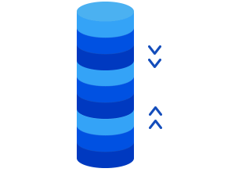

# Micro-Reddit

> This project is to help understand the creation of models with ActiveRecord to use in Ruby on Rails applications.

This is the second project in the Microverse Rails technical curriculum.

## Built With

- Rails,
- Ruby,
- ActiveRecord

## Setup

Clone the [repository URL](https://github.com/mateomh/micro-reddit.git), get into the project root folder and run the migrations for the database
> rails db:migrate

And then use the rails console for the project to run the tests using the command
> rails console

## Authors

👤 **Mateo mojica**

- Github: [@mateomh](https://github.com/mateomh)
- Twitter: [@mateo_m_h](https://twitter.com/mateo_m_h)
- Linkedin: [Mateo mojica](https://linkedin.com/mateo_mojica_hernandez)

👤 **Author2**

- Github: [@githubhandle](https://github.com/githubhandle)
- Twitter: [@twitterhandle](https://twitter.com/twitterhandle)
- Linkedin: [linkedin](https://linkedin.com/linkedinhandle)

## 🤝 Contributing

Contributions, issues and feature requests are welcome!

Feel free to check the [issues page](issues/).

## Show your support

Give a ⭐️ if you like this project!

## Acknowledgments

- Hat tip to anyone whose code was used
- Inspiration
- etc

## 📝 License

This project is [MIT](https://opensource.org/licenses/MIT) licensed.